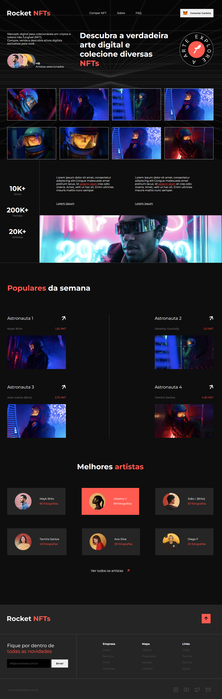

 

  

## 💡 Projeto

Rocket NFTs é uma landing page completa sobre NFTs e faz parte dos desafios propostos aos alunos do Discover da Rocketseat.
Você pode encontrar o design em: https://www.figma.com/file/VDRCPVEywzdweh8BGnu0M5/Rocket-NFTs/duplicate

## 🛠 Tecnologias

&nbsp;
&nbsp;

## 🚀 Rocket NFTs

## 📝 License

Esse projeto está sob a licença MIT. Veja o arquivo [LICENSE](LICENSE.md) para mais detalhes.

---
Lucas Lima